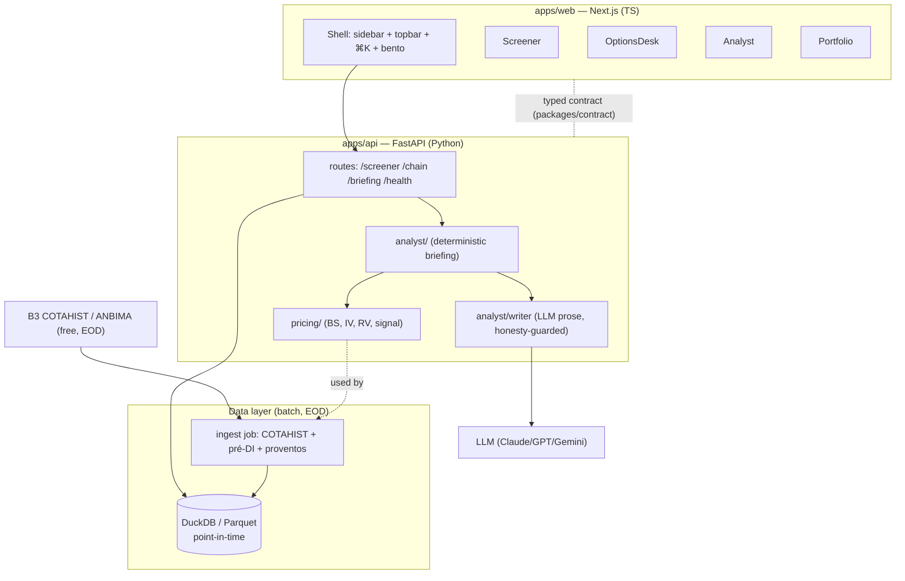

# ATLAS — Solution Architecture

**Date:** 2026-06-29 · **Status:** accepted · Complements the spec (`specs/2026-06-29-atlas-terminal-b3-design.md`).

## 1. Requirements

**Functional:** EOD multi-asset terminal for B3 (ações/opções/derivativos) — screener, options desk (chain, IV/greeks, payoff), portfolio/risk, asset detail, and an **Analyst** that produces honest, two-sided briefings with 3 risk profiles. Single advanced user (own capital).

**Non-functional:**
- **Honesty/integrity** (hard constraint): facts + labeled heuristics only; provenance + `asof` on every number; no buy/sell prophecy. Architecture must make dishonesty hard (guard layer).
- **Correctness** of quant (IV/greeks/RV) — validated, NaN-safe.
- **Low cost / local-first:** free data (COTAHIST), runs on the user's machine; cloud optional.
- **Maintainability:** small, focused, independently testable units.
- **Latency:** not real-time (EOD); daily batch is acceptable. This relaxes the whole design.

## 2. Architecture diagram

## 3. Key decisions (ADRs)

### ADR-001: Monorepo, hard backend/frontend split via a typed contract
**Decision:** `apps/api` (Python) owns ALL quant/data; `apps/web` (Next.js) only renders a typed JSON contract (`packages/contract`). **Alternatives:** Next.js API routes doing quant (rejected — JS quant is weaker, mixes concerns); a single Python+HTMX app (rejected — loses the "impressive interactive" frontend goal). **Trade-off:** two runtimes/build chains, but clean boundaries, independent testing, and the frontend can develop against fixtures before the API exists.

### ADR-002: Pure-stdlib quant core (no numpy/scipy)
**Decision:** BS/IV/RV in pure Python. **Alternatives:** numpy/scipy (rejected for the core — wheel risk on Python 3.14, heavier deps, marginal benefit at EOD volume). **Consequence:** zero dependency risk, fully auditable, fast enough for EOD; if intraday/vectorized needs arrive, vectorize behind the same interface. Validated by impartial review + 28 tests.

### ADR-003: EOD batch + DuckDB/Parquet, not a realtime DB
**Decision:** daily ingestion writes point-in-time Parquet; DuckDB queries it. **Alternatives:** Postgres + streaming (rejected — over-engineering for free EOD data, operational cost). **Trade-off:** no intraday; but matches the free-data reality and keeps it local-first and cheap. Realtime is a plug-in later without re-architecting (swap the data source behind the API).

### ADR-004: LLM writes prose only, behind an honesty guard (never predicts)
**Decision:** the deterministic `analyst/briefing` computes ALL facts/sizing/sides; the LLM (`writer`) only renders readable prose, and every output passes a `guard()` that rejects buy/sell/prophecy language and requires the max-loss + disclaimer. **Alternatives:** LLM generates the analysis/signal (rejected — fabricates edge, violates the honesty NFR and the red-team verdict). **Consequence:** the system is structurally incapable of emitting a fake prediction; worst case the LLM fails the guard and we fall back to the deterministic template.

### ADR-005: Deterministic-first everywhere; ML/LLM are thin, optional layers
**Decision:** core value (pricing, screener, briefing) is deterministic and testable; ML/LLM sit on top and must justify themselves. **Rationale:** the red-team showed ML doesn't beat honest baselines here; determinism is the integrity backbone.

## 4. Risks & mitigations

| Risk | Mitigation |
|---|---|
| B3 EOD data dirty (stale, no settlement) | Liquidity/stale filters, mid-of-offers, NaN-safe pricing, provenance badges |
| Silent IV error (strike/rate) | Strike adjustment, pré-DI curve, validation vs reference, impartial review (done) |
| LLM emits a prediction | Honesty `guard()` + deterministic fallback (ADR-004) |
| Two-runtime complexity | Typed contract + fixtures; each side testable alone |
| Scope creep | Phased v1/v2/v3; deterministic-first |

## 5. Build sequence (this session)

API (FastAPI wiring pricing+analyst) → frontend scaffold (shell + design system) → real COTAHIST ingestion. Each lands as tested, committed increments.
